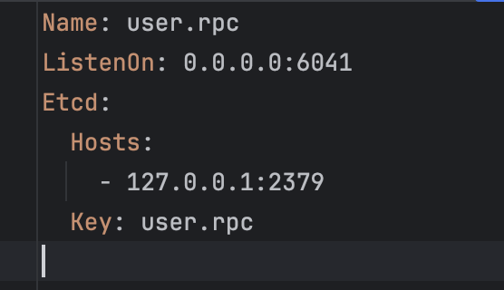
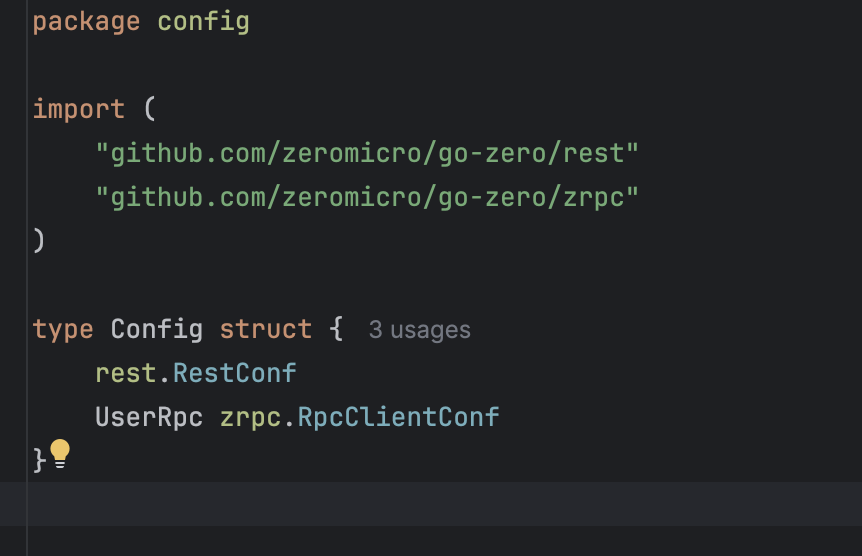
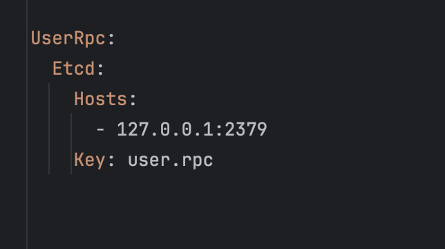
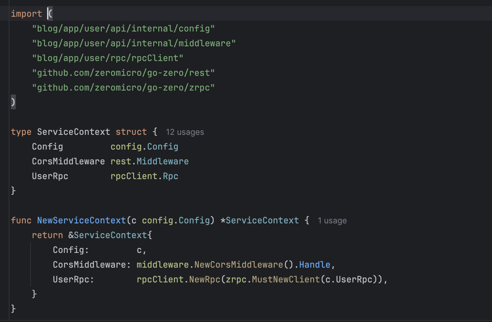
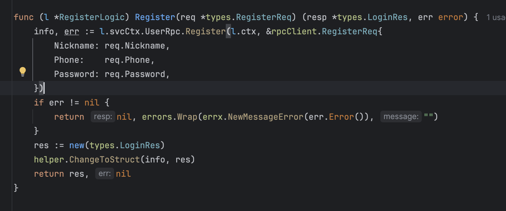

# 用户模块

## 生成api
```bash
# 进入项目目录
# 创建模块
mkdir -p app/user/api
# 进入接口模块
cd app/user/api
# 创建api.api文件
# 编辑api.api 语法参考@see  https://go-zero.dev/docs/tutorials
vim api.api 
# 执行.api文件
# -dir 指定生成目录  
# --style 生成代码风格 goZero 小驼峰写法
# --home 生成代码采用的模板 
# 具体参数 @see https://go-zero.dev/docs/tutorials/cli/api
goctl api go --api api.api -dir ./  --style="goZero" --home="../../../template"
# 启动项目
go run api.go
# 代码格式化
goctl api format -dir="./"
```

## 生成rpc
```bash
# 进入项目目录
# 创建模块
mkdir -p app/user/rpc
# 进入接口模块
cd app/user/rpc
# 编辑 user.proto
# 编辑.proto 语法参考@see https://go-zero.dev/docs/tasks/dsl/proto
vim user.proto 
# 执行.proto文件
# -dir 指定生成目录  
# --style 生成代码风格 goZero 小驼峰写法
# --home 生成代码采用的模板 
# -m 采用分组模式
# 具体参数 @see https://go-zero.dev/docs/tutorials/cli/rpc
goctl rpc protoc ./user.proto  --go_out=./pb --go-grpc_out=./pb --zrpc_out=.  --style="goZero" --home="../../../template" -m   

```

## api 链接 rpc
- 先用Docker启动etcd
```bash
docker run -d --name Etcd-server \
--publish 2379:2379 \
--publish 2380:2380 \
--env ALLOW_NONE_AUTHENTICATION=yes \
--env ETCD_ADVERTISE_CLIENT_URLS=http://etcd:2379 \
bitnami/etcd:latest
```
- 更改rpc的配置文件
  - 编辑 rpc/etc/user.yaml
    - 
- 更改api的配置文件
  - 编辑 api/internal/config/config.go
    - 
  - 编辑 api/etc/user-api.yaml
      - 
    - 编辑 api/internal/svc/serviceContext.go
      - 
- 使用rpc
  - 

